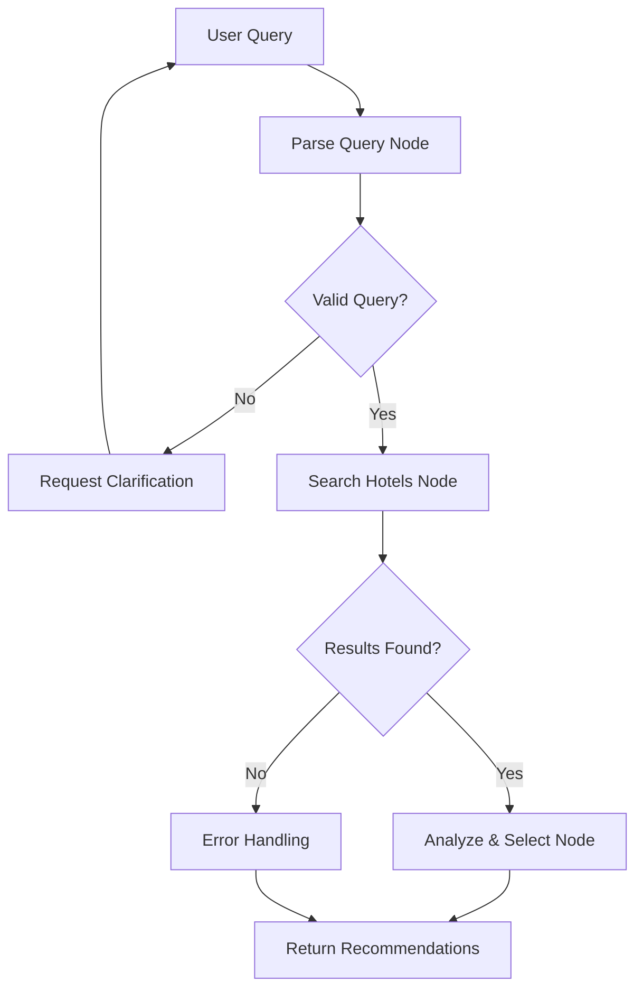

# Hotel LLM - AI-Powered Hotel Price Comparison

This is an intelligent hotel booking assistant built with [Next.js](https://nextjs.org) and [LangGraph](https://js.langchain.com/docs/langgraph). The application uses AI to search across platform and find the cheapest options for your travel needs.

## 🏨 Features

- **Smart Hotel Search**: Natural language hotel search queries (e.g., "Find a cheap hotel in Paris for next weekend")
- **Multi-Platform Comparison**: Searches across multiple hotel booking platforms (Booking.com, Expedia, Hotels.com)
- **LangGraph Workflow**: Advanced AI workflow with StateGraph, conditional routing, and state management
- **Conversation Memory**: Maintains context across multiple queries for follow-up questions
- **Real-time Streaming**: Stream search results and analysis in real-time
- **Cheapest Option Recommendation**: Automatically finds and recommends the most affordable option
- **Quick Search Buttons**: Pre-configured search options for popular destinations
- **Follow-up Questions**: Ask clarifying questions or modify search parameters
- **Modern UI**: Beautiful, responsive interface with syntax highlighting and markdown support

## 🚀 How It Works

The application uses LangGraph's StateGraph for sophisticated AI workflow orchestration:

1. **Query Parsing**: AI intelligently parses natural language queries and maintains conversation context
2. **Conditional Routing**: LangGraph's conditional edges route workflow based on state conditions
3. **Multi-Platform Search**: Parallel searches across hotel providers for comprehensive coverage
4. **Price Analysis**: Advanced comparison algorithm with detailed LLM-powered recommendations
5. **State Management**: LangGraph's annotation-based state with automatic merging and validation

### LangGraph Workflow Architecture



## Prerequisites

This project uses:
- **pnpm** as the package manager
- **Node.js** version specified in `.tool-versions`
- **Google Gemini API** for AI processing
- **Flutter** for mobile app development

## Getting Started

### 1. Install Dependencies

First, ensure you have the correct Node.js version installed:

```bash
# If using asdf
asdf install

# Or check .tool-versions for the required versions
```

Install dependencies:

```bash
pnpm install
```

### 2. Environment Setup

Create a `.env.local` file in the root directory and add your API keys:

```bash
# Google Gemini API Key (required)
# Get your API key from: https://ai.google.dev/
GEMINI_API_KEY=your_gemini_api_key_here
```

### 3. Run the Development Server

```bash
pnpm dev
```

Open [http://localhost:3000/llm](http://localhost:3000/llm) with your browser to access the hotel search interface.

## 💡 Usage Examples

### Initial Queries
Try these natural language queries:

- "Find a cheap hotel in New York for December 25-27 for 2 guests"
- "Budget hotel in London for 1 night"
- "Family hotel in Orlando for 4 guests, 3 nights"
- "Hotel in Tokyo for 2 people, next weekend"

### Follow-up Queries
The system maintains conversation context, so you can ask:

- "What about for 3 nights instead?"
- "Show me options under $150 per night"
- "Any hotels with pools?"
- "Change dates to next month"

## 🏗️ Architecture

### LangGraph StateGraph Workflow

The application uses LangGraph's powerful StateGraph for workflow orchestration:

#### **State Management**
- **Annotation-based State**: Type-safe state definition using LangGraph Annotations
- **Automatic State Merging**: LangGraph handles state updates and merging automatically
- **Conversation History**: Maintains full context across multiple interactions
- **Error Propagation**: Graceful handling of errors through state channels

#### **Nodes & Edges**
- **Pure Function Nodes**: Each node is a pure function that returns partial state updates
- **Conditional Routing**: LangGraph's conditional edges route based on state conditions
- **Graph Compilation**: Optimized execution plan with built-in error handling
- **START/END Nodes**: Proper workflow entry and exit points

#### **Node Architecture**
```typescript
// Each node is a pure function in LangGraph
async function parseQuery(state: typeof GraphState.State) {
  // Process the state and return partial updates
  return {
    query: extractedQuery,
    analysis: "Parsing complete"
  };
}
```

#### **State Definition**
```typescript
const GraphState = Annotation.Root({
  query: Annotation<HotelSearchQuery>({
    reducer: (current, update) => update ?? current,
    default: () => ({} as HotelSearchQuery),
  }),
  // ... other state fields
});
```

## 🔧 Technical Stack

- **Frontend**: Next.js 15, React 19, TypeScript
- **AI/LLM**: Google Gemini 2.0 Flash, LangChain Core
- **Workflow Engine**: LangGraph StateGraph with Annotation-based state
- **UI Components**: Custom React components with hooks
- **Styling**: CSS Modules with modern gradients and animations
- **Code Highlighting**: Shiki for syntax highlighting
- **Markdown**: React Markdown with GFM support
- **API Integration**: Axios for HTTP requests
- **Date Handling**: date-fns for date operations
- **Streaming**: Server-Sent Events for real-time updates

### Customizing the LangGraph Workflow

The LangGraph StateGraph can be extended by:

- **Adding New Nodes**: Create new processing steps
```typescript
async function newProcessingNode(state: typeof GraphState.State) {
  // Custom logic
  return { 
    customField: processedData,
    analysis: "Custom processing complete"
  };
}

// Add to workflow
.addNode("newProcessing", newProcessingNode)
```

- **Adding Conditional Edges**: Implement smart routing
```typescript
function shouldProcessCustom(state: typeof GraphState.State): string {
  if (state.customCondition) {
    return "customProcessing";
  }
  return "defaultPath";
}

// Add conditional routing
.addConditionalEdges("parseQuery", shouldProcessCustom, {
  customProcessing: "customProcessing",
  defaultPath: "searchHotels",
})
```

- **Extending State**: Add new state fields
```typescript
const ExtendedGraphState = Annotation.Root({
  ...GraphState.spec, // Inherit existing state
  customField: Annotation<CustomType>({
    reducer: (current, update) => update ?? current,
    default: () => defaultValue,
  }),
});
```

### UI Customization

- **Components**: All UI components are modular and can be customized
- **Styling**: CSS modules allow easy theming and customization
- **Quick Actions**: Modify `src/app/llm/constants.ts` for different quick search options

## 🔄 Opportunities

- We manage the LangGraph Engine and everything by our own, so the potential is huge. We can integrate
  - API integration - For hotel search matcher and internal price comparison or commission/ads, etc
  - Agent integration - Explore the potential of agents to improve the workflow, i.e., fetching data from other platforms for multi-purposes
  - Unlimited LLMs integration - We can use any LLM, not just Gemini
  - Vector database integration - We can use any vector database for optimization and faster retrieval
  - And many more...

## 🚀 Deployment

### Environment Variables for Production

```bash
GEMINI_API_KEY=your_production_gemini_api_key
```

### Deploy on Vercel

[](https://initiative-hotel-agent.vercel.app/llm)


### Performance Considerations

- **LangGraph Optimization**: Compiled StateGraph for efficient execution
- **Streaming**: Uses Server-Sent Events for real-time updates
- **Error Recovery**: LangGraph's built-in error handling and state management
- **State Validation**: Automatic state merging and validation
- **Caching**: Browser caching for static assets

## 🔍 Key Features Explained

### LangGraph StateGraph
Advanced workflow orchestration with automatic state management, conditional routing, and built-in error handling.

### Conversation Memory
LangGraph's state management maintains context across queries, allowing for natural follow-up questions.

### Smart Query Parsing
Advanced AI parsing with LangGraph's conditional edges that handle ambiguous queries and request clarification.

### Multi-Provider Search
Parallel searches across multiple hotel booking platforms with LangGraph node orchestration.

### Conditional Workflow Routing
LangGraph's conditional edges adapt the workflow based on query complexity and results.

## 📚 Learn More

- [LangGraph Documentation](https://langchain-ai.github.io/langgraph/)
- [LangChain JS Documentation](https://js.langchain.com/)
- [LangGraph JS Documentation](https://js.langchain.com/docs/langgraph)
- [Google Gemini API](https://ai.google.dev/)
- [Next.js Documentation](https://nextjs.org/docs)
- [React 19 Features](https://react.dev/blog/2024/04/25/react-19)

### Development Guidelines
- Follow TypeScript best practices
- Use LangGraph patterns for workflow modifications
- Maintain annotation-based state definitions
- Add proper error handling in nodes
- Include tests for new features
- Update documentation
